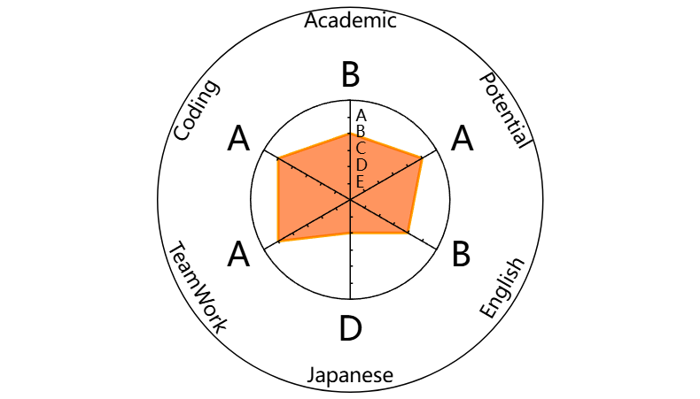

# Tang Zhizhe(zztang)(CN:汤至哲)

> Master of Artificial Intelligence(AI)  
> Seeking PhD Position start at 2026 Fall or 2027 Spring

🌐 **Info Website:** [https://zztang.anhuiuniversity.top](https://zztang.anhuiuniversity.top)  
💻 **Github** [https://github.com/University-Pro](https://github.com/University-Pro)  
📧 **Email** zztang@stu.ahu.edu.cn  
Ⓜ️ **ORCID** https://orcid.org/0009-0006-9083-8967  
✏️ **Blog Website** [My Blog](http://8.133.3.212)  
📍 **Location:** Hefei, Anhui, China

---

## 👋 About Me

Hello! I am a Master's student at [School of Internet](https://si.ahu.edu.cn/) in [Anhui University](https://www.ahu.edu.cn/),specializing in Deeplearning in Computer Vision.  
My research interests lie in **Computer Vision Processing**, **Medical Image Segmentation(MIS)**, and their applications in autonomous systems.

### Personal Feature Plan
I am actively pursuing a PhD position in Japan, with a planned start in Fall 2026 or Spring 2027.  
To facilitate a smooth transition, I am open to beginning as a research student (研修生) for several months to adapt to life in a new cultural and academic environment.  
Japan is my preferred destination for doctoral studies compare with other countries in Asia.

### Ability in Language and Academic Skill
I am able to reads and comprehends full English documentation fluently.  
I have achieved a **TOEIC 805** for first time in **July 2025**; currently working toward a **6.5 IELTS** result.  
I am still a beginner of Japanese. 
I am proficient in **Python**, and **PyTorch**, and have hands-on experience with Deep Learning in **Medical Image Segmenation Framework**.  
I am skilled in surveying upstream research, reproducing state-of-the-art models in multi-area, and extracting key components for implementation.  
I have strong **Linux proficiency** and am adept at troubleshooting research-related issues via command-line only environments.  
I also possess foundational knowledge of **Docker** and have experience with **virtualization platforms** (such as Proxmox) for managing GPU resources across workstations and servers for training model.[(Check My Portainer Manager Picture)](./pictures/1.png).  

### Another Skills
Additionally, I built and maintained an LLM (Large Language Model) server within my university’s network, serving around 900 users with access to various open-source models (e.g., Qwen and DeepSeek).[(Check My Nginx Monitor)](./pictures/2.png).  
I am also experienced in maintaining and optimizing hardware components (CPU, GPU, memory, networking, PCI-E, etc.) for high-performance deep learning workloads.  
For example, I successfully modified my RTX 2080 Ti by replacing its 1GB VRAM chips with 2GB ones, effectively doubling the VRAM to 22GB.[(Check The Pics of My GPU)](./pictures/1.jpg).  

### Summary
I’ve included a radar chart below to summarize my technical capabilities:  

---

## 🔬 Research Interests

*   **2D/3D Images Segmentation/Classificationn:** Real-time, high-fidelity images segmentation/classification in dynamic environments.
*   **Image in interdisciplinary:** Use Deeplearning to process(Segmentation/Classification...) images from interdisciplinary.
---

## 🎓 Education

*   **M.S. in School of Internet** (2023 - 2026)
    *   Anhui University, Hefei, Anhui, China
    *   **Thesis1:** "DLKUNet: A Lightweight and Efficient Network With Depthwise Large Kernel for Medical Image Segmentation" | [🔗 Link to PDF/Thesis Repository](https://github.com/University-Pro/DLKUNet)
    *   **Thesis2:** "KANSeg: An efficient medical image segmentation model based on Kolmogorov-Arnold networks for multi-organ segmentation" | [🔗 Link to PDF/Thesis Repository](https://github.com/University-Pro/KANSeg)
    *   **Thesis3:** ""
    *   **GPA:** 3.85
    *   **Advisor:** [Prof. Zhu] [ORCID](https://orcid.org/0000-0002-4001-1551)

*   **R.A. in School of Internet** (2022-2023)
    *   Anhui University, Hefei, Anhui, China
    *   Majoy: Maintain

*   **B.E. in Automation** (2018 - 2022)
    *   *Your Undergraduate University*, City, Country
    *   **GPA:** 3.8/4.0

---

## 🛠️ Projects

### [项目1名称] | Python, PyTorch, Open3D
**[🔗 Live Demo](你的项目演示链接) | [📂 Code](你的项目代码仓库链接)**

*   描述这个项目是做什么的，解决了什么问题。
*   详细说明你的**贡献**和使用的**技术方法**（例如：Implemented a keyframe-based pose graph optimization module...）。
*   **结果如何？**（例如：Achieved 20% improvement in trajectory accuracy on the TUM dataset compared to ORB-SLAM3）。

### [项目2名称] | C++, ROS, PCL
**[📂 Code](你的项目代码仓库链接)**

*   另一个项目的描述，同样遵循上面的结构。
*   如果项目是与课程、论文或实习相关的，请明确指出。

*(建议放置3-4个你最得意、最相关的项目，并确保代码仓库是整理好的、有文档的)*

---

## 📜 Publications & Preprints

1.  **Zhang, S.**, Li, W., & Chen, Y. (2023). "论文标题". In *Conference on Robot Learning (CoRL)*. **[🔗 Paper Link]**
    *(如果尚未发表，可以写 "Manuscript in Preparation" 或 "To be submitted to ICRA 2024")*

---

## 🏆 Honors & Awards

*   **National Scholarship** (2021) - Ministry of Education, China
*   **First Prize**, National University Robot Competition (2020)

---

## 📫 Let's Connect!

I am always open to discussing research opportunities, collaborations, or any interesting ideas.

*   GitHub: [https://github.com/你的用户名](https://github.com/你的用户名)
*   LinkedIn: [https://linkedin.com/in/你的用户名](https://linkedin.com/in/你的用户名)
*   Twitter/X: [@你的用户名](https://twitter.com/你的用户名) *(可选，如果你常用的话)*
*   Email: zhangsan@example.com

---

⭐️ *From [你的用户名](https://github.com/你的用户名)*
